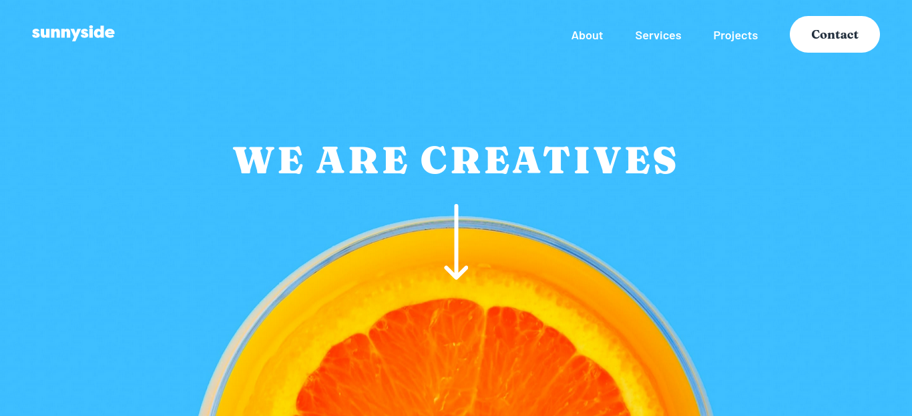

# Frontend Mentor - Sunnyside agency landing page solution

This is a solution to the [Sunnyside agency landing page challenge on Frontend Mentor](https://www.frontendmentor.io/challenges/sunnyside-agency-landing-page-7yVs3B6ef). Frontend Mentor challenges help you improve your coding skills by building realistic projects.

## Table of contents

- [Overview](#overview)
  - [Screenshot](#screenshot)
  - [Links](#links)
- [My process](#my-process)
  - [Built with](#built-with)
- [Author](#author)

## Overview

### Screenshot

### Links

- Solution URL: [Add solution URL here](https://your-solution-url.com)
- Live Site URL: [Add live site URL here](https://your-live-site-url.com)

## My process

### Built with

- Semantic HTML5 markup
- CSS
- Flexbox
- CSS Grid

## Author

- Frontend Mentor - [@IjulDev](https://www.frontendmentor.io/profile/IjulDev)
- Facebook - [@mhd.zulfikar.pinem](https://www.facebook.com/mhd.zulfikar.pinem)
- Instagram - [@zulfikar.pinem](https://www.instagram.com/zulfikar.pinem)
